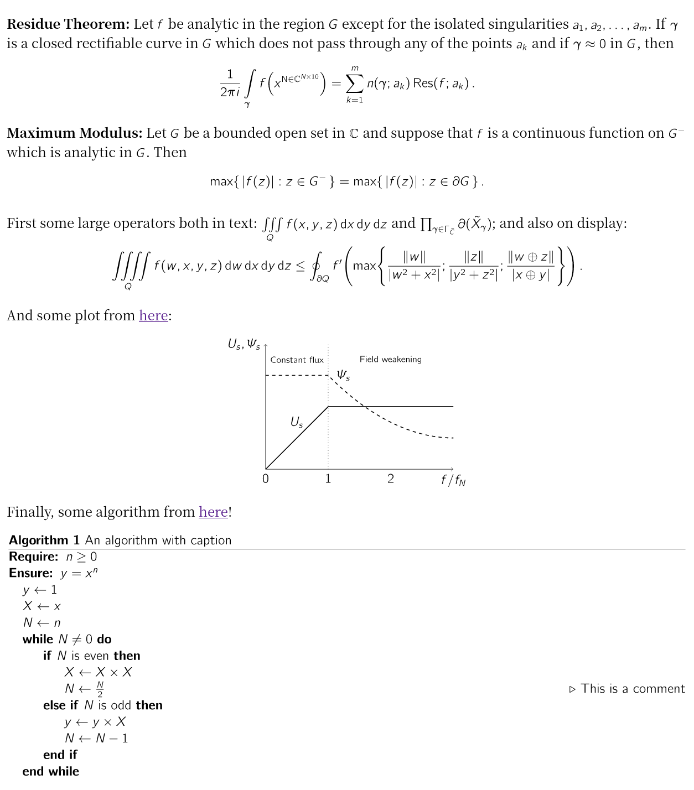

# just-latex

**How do you render LaTeX fragments on the Web? MathJaX? KaTeX? Why not ... just use LaTeX?**


[](https://crates.io/crates/just-latex)

just-latex is a simple [Pandoc](https://pandoc.org/) filter that chains a bunch of existing tools in the TeX ecosystem, enabling the use of the actual LaTeX engine to render LaTeX fragments when converting to HTML. It aims to occupy a niche and provide a new option for users hampered by MathJaX or KaTeX.

## Features

* Full TeX/LaTeX compatibility because we are just calling them under the hood. This means you can define macros, change fonts, use `tikz`, etc. -- just like what you do with a LaTeX document. 
* Uses Pandoc so it supports a wide variety of input formats and can be embedded into various workflows relatively easily, e.g. `hexo-renderer-pandoc` if you have a blog powered by Hexo (like me).
* Fragments are converted to SVG images which looks great regardless of scaling.
* Compresses the SVG so the resulting page does not get bloated by a lot.

## Demo



Please see `examples/demo.md` and `examples/demo.html` for a showcase of this program. The demo features the use of `cmbright` package to change the font, `tikz` to make a plot, and `algpseudocode` to typeset some pseudocode. The command to produce `demo.html` is (run it under `examples/`)
```bash
pandoc demo.md --filter ../target/debug/just-latex -o demo.html
```
(assuming you have a debug build)
The demo is partially adapted from [here](https://tex.stackexchange.com/questions/425098/which-opentype-math-fonts-are-available).

Another demo `examples/fwht.md` is actually a [blog post](https://danglingpointer.fun/2020/08/07/FWHT/) I wrote years ago. It has more maths and should be considered a realistic use case of this program.

The `examples` folder also contains a sample configuration file.

*Note:* You can inspect the HTML code on Github here, but to actually see how it's rendered, you have to download the raw file -- Unfortunately somehow service like https://htmlpreview.github.io/ does not work here as the LZMA decompression script is not being loaded. Alternatively, `examples/demo.png` is a screenshot of the output HTML.

## Comparison with ...

### MathJaX and KaTeX

I create this program with a different set of goals in mind from MathJaX and KaTeX. The latter work great in their comfort zones, but essentially they are still just partial JS ports of TeX, so both come with limitations. 

For instance, as a serif font the Computer Modern family actually does not look that good on screen, but neither MathJaX 3 nor KaTeX gives you another option (though MathJaX does fine-tune the CM fonts they use for screen display). In LaTeX we are free to use packages like `cmbright`, `arev`, `beamer`, or load OTF math fonts with `unicode-math` to solve the issue, wouldn't it be great if we could do that on the Web? 

Another example would be the use of macros. MathJaX and KaTeX can deal with macros but things can be a little bit tricky if you define a macro in one block and use it in another. 

This project is originally intended for bloggers like me, where most contents are created statically and can be rendered statically. MathJaX and KaTeX are still unbeatable when it comes to real-time and dynamic rendering of TeX equations.

Basically, if you have been happy with MathJaX and KaTeX, use them. If you want to explore breaking the limitations imposed by either libraries, check this out!

### TeX4ht, LaTeXML, Tralics, etc.

These programs convert LaTeX *documents* to HTML whereas just-latex deals with LaTeX *fragments* in formats like Markdown or Org. Surely one can use Pandoc to convert a Markdown document into LaTeX and call these tools to then convert it into HTML, but this seems to me to be a little bit complicated. These tools are also big systems that require some setup. In addition, to my knowledge, LaTeXML and Tralics are TeX *emulators* so there might be compatibility issues too. 

Also note that these systems aim to be clever by trying to identify certain elements in the input document and do them "the Web way," e.g. maths are converted to MathML or handed over to MathJaX and texts are extracted to be reflowed by the browser. That, in itself, seems like a source of troubles. 

In comparison, just-latex are **small, simple and dumb**. It has less than 600 lines of code in Rust and uses mature libraries in the TeX community so you can fully understand how it works in 10 minutes (you will see below) and be 99% confident the rendered result will be identical to the one you see in a PDF.

### SwiftLaTeX

SwiftLaTeX is the entire TeX engine compiled to WebAssembly and running in the browser. It shouldn't really be compared to this program because the former runs in the client's browser where the latter does all the rendering on server side.

## How it Works

1. Just-latex is a Pandoc filter, so Pandoc will take care of the parsing of the input document -- be it a Markdown, a RestructuredText, an Org, or really anything Pandoc supports.
2. The program identifies the `MathInline` elements in the document tree given by Pandoc.
3. It then joins these fragments together in the order they appear (with some deduplication), surrounds the result with a user-defined preamble and postamble, and writes the result to `.tex` file in a temp directory. For example, the preamble could be
    ```latex
    \documentclass[12pt]{article}
    \usepackage{amsmath, amssymb, amsthm, bm}
    \begin{document}
    ```
    with the postamble
    ```latex
    \end{document}
    ```
4. It calls (La)TeX (can be either pdfTeX, XeTeX, or LuaTeX) to compile that `.tex` into a PDF file.
5. It then calls [dvisvgm](https://dvisvgm.de/) to convert the PDF into an SVG. Dvisvgm is shipped with modern TeX distros.
6. For each fragment, the programs uses the SyncTeX library to compute where it ends up in the PDF and hence the SVG. SyncTeX has been built into modern TeX engines for years and is what nearly all TeX editors use to achieve source-output synchronization.
7. The regions are refined with the usvg library by looking at the actual paths.
8. The `MathInline` nodes are replaced by `RawInline` nodes with ``s properly styled to display computed regions of the SVG. E.g.
    ```html
    
    ```
    For inline fragments care will be taken to align the baseline of the image to the baseline of the surrounding text.
9. The SVG itself is LZMA-compressed, then base64-encoded and then stuffed into a short Javascript code that decompresses the SVG, generates an object URL and fills in the `...` part in the `` tags above when the page loads. This code, along with the `<script>` that loads the [LZMA decompressor](https://www.npmjs.com/package/lzma) (7 KB in size), is appended to the document tree as a `RawBlock` node.
10. The program returns the modified tree to Pandoc which finishes things up and output a single HTML. When the page loads you will see the rendered fragments exactly as they would appear in a PDF.

That's it. 10 steps, 1 file in, 1 file out.

## Dependencies and Building

To run this program you will need Pandoc and a TeX distribution. To build it you further need a Rust toolchain and a C toolchain. Clone this repo (make sure you use `git clone --recurse-submodules` so the `synctex` code is cloned), and run `cargo build`.

## Configuration

Pandoc filters cannot take arguments directly from command line, so just-latex reads configuration from files at different locations:
* It will first try looking for a `jlconfig.toml` under the same directory as the executable (this can be [ambiguous](https://doc.rust-lang.org/std/env/fn.current_exe.html) when symlinks are involved), and load that as a config file. 
* Then it will look for a `jlconfig.toml` under the working directory, and load it if it's there.

A config file does not need to specify all config items, as it merely overrides config items previously loaded. I also plan to add support for configuration on a per-document basis from the YAML metadata block in the future.

All configuration items are defined in `config.rs` with their default values.

## Tips
Everything in `$$`s is treated as math by Pandoc and just-latex will normally surround it with `\[` and `\]`. To write LaTeX without being surrounded in a math environment, you can:
* Start the first line in `$$` with `%raw`. The program will detect this. Or,
* Use the Pandoc's extended raw attribute syntax:
    ````markdown
    ```{=tex}
    % Your code here.
    ```
    ````
  You don't have to type `%raw` here.

Note that if you write complicated non-math content inside a `$$` block, then sometimes `pandoc` will try to be clever and recognize your code as a raw TeX block directly, but the surrounding `$$`s will become ordinary visible text. Thus if you really write non-math stuffs the second format is recommended (plus it does not upset editors that attempt to render your Markdown with MathJaX all the time, such as Typora).

Or, sometimes you may want a block that is solely dedicated to definition of macros or altering internal TeX variables. This is a problem because when just-latex asks SyncTeX where these code end up in the PDF it becomes confused -- such code do not produce any content on their own! Frustrated, SyncTeX returns the bounding box for the next fragment, which is wrong. In this case you must start such block with `%dontshow`, either in a `$$` block or a `{=tex}` block. This informs just-latex to only include it in the intermediate TeX file and not to call SyncTeX. You can see this in the demo file.

## Limitations 

* Dvisvgm converts texts in PDF to SVG paths, so texts in rendered fragments are not selectable or copyable. Also this makes the resulting SVG files huge. With compression this program adds less than 100 KB to the generated HTML for a typical Markdown document (such as a blog post).

* TeX is slow, so is dvisvgm. Although the program itself runs quite fast converting a document still takes around 1 sec.

* Right now it assumes dvisvgm only gives one SVG, that is, all LaTeX fragments together should fit in one page as specified by the preamble. A page in TeX can be as long as 16384 pt so this is not really a big issue unless your article is really, really long.

* It is your reponsibility to set up the preamble in a way that the font size of the LaTeX fragments matches that of the surrounding text in HTML. For example, the default text size of HTML is 12pt, so you should pass `[12pt]` as an option to the `\documentclass{article}`. Also, note that for now the program does not do any special handling to inline maths in headings. This is a known issue and I plan to fix that later. 


## Is it Any Good?

Yes.